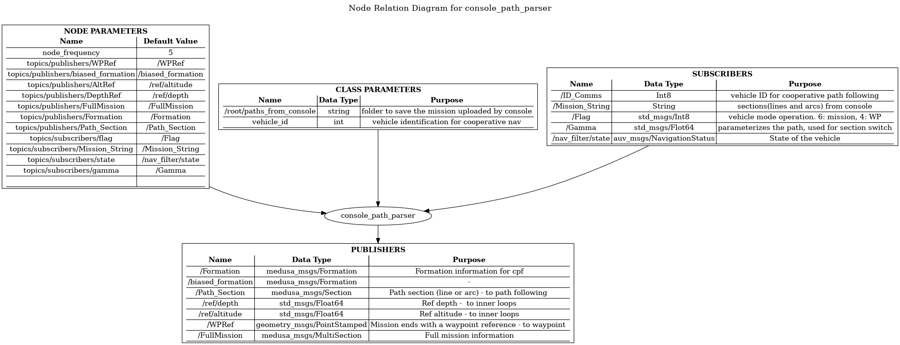
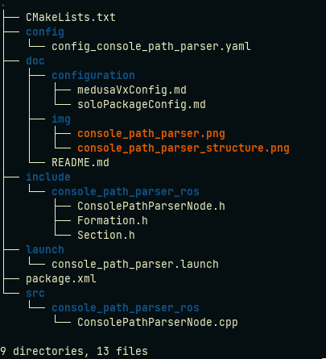

# Console path parser package

Console path parser is a ROS package written in C++ responsible for parsing a mission/path string from an external source to a format that can be interpreted by the path following algorithms of the Medusa Vx stack.




## Rationale

#### Mission/path string format

The format of the mission for a single vehicle comes from the console in a string like the following:
```
#Version
3
#Xrefpoint Yrefpoint UTM Zone
491890.163 4290832.905 29S

# LINE xInit yInit xEnd yEnd velocity <nVehicle> <gamma> <user data>
# ARC xInit yInit xCenter yCenter xEnd yEnd velocity adirection radius <nVehicle> <gamma> <user data>
# POINT xInit yInit radius velocity heading time <nVehicle> <gamma> <user data>
# DEPTH depth time <nVehicle> <gamma> <user data>
# ALT altitude time <nVehicle> <gamma> <user data>

Example of lawn mower maneuver for a single vehicle

# Mission from vehicle -1
LINE -20.26 -20.26 -20.26 10.13 0.30 -1 
ARC -20.26 10.13 -10.13 10.13 0.00 10.13 0.30 -1 10.13 -1 
LINE 0.00 10.13 0.00 -10.13 0.30 -1 
ARC 0.00 -10.13 10.13 -10.13 20.26 -10.13 0.30 1 10.13 -1 
LINE 20.26 -10.13 20.26 20.26 0.30 -1 
```

For case where cooperative path following is desired the mission is adapted as seen in the example bellow:
```
#Version
3
#Xrefpoint Yrefpoint UTM Zone
491854.338 4290819.848 29S

# FORMATION ID1 x_dist y_dist ID2 x_dist y_dist ID3 x_dist y_dist
FORMATION 1 0 -3 2 0 0 3 0 3

# LINE xInit yInit xEnd yEnd velocity <nVehicle> <gamma> <user data>
# ARC xInit yInit xCenter yCenter xEnd yEnd velocity adirection radius <nVehicle> <gamma> <user data>
# POINT xInit yInit radius velocity heading time <nVehicle> <gamma> <user data>
# DEPTH depth time <nVehicle> <gamma> <user data>
# ALT altitude time <nVehicle> <gamma> <user data>

# Mission from vehicle -1
LINE -24.57 -24.57 -24.57 12.29 0.30 -1 
ARC -24.57 12.29 -12.29 12.29 0.00 12.29 0.30 -1 12.29 -1 
LINE 0.00 12.29 0.00 -12.29 0.30 -1 
ARC 0.00 -12.29 12.29 -12.29 24.57 -12.29 0.30 1 12.29 -1 
LINE 24.57 -12.29 24.57 24.57 0.30 -1 
```

Note that the only difference is the addition of a **FORMATION** line.
Console path parser will read this information and save in a vector of **sections** (**Mission**). The section structure can be seen below.

#### Path following sections format

```c++
	SECTION()
	{
		Type = 0; # Line / Arc / Point / Depth / ALT
		xi = 0; # initial x of section
		yi = 0; # initial y of section
		xc = -1; # x of center of arc (-1 if line or point)
		yc = -1; # y of center of arc (-1 if line or point)
		xe = 0; # ending x of section
		ye = 0; # ending y of section
		velocity = 0; # velocity desired of the vehicle
		adirection = 0; # -1 if vehicle is turning clockwise, -1 otherwise (only applied to arcs)
		radius = 0; # radius of the arc
		heading = -1;
		time = -1; 
		nVehicle = -1;
		Gamma_s = 0; # Starting gamma (not normalized)
		Gamma_e = 0, # Ending gamma (not normalized)
        depth = 0.0;
	}
```

The console path parser will then publish the first section (topic **/path_section**) of the vector while subscribing to the topic **/Gamma** which contains a the value of the parameter gamma (see path following theory) not normalized. When the received gamma surpasses the ending gamma (**Gamma_e**) of the section, it will then update its section and publish it. It will do this process for the amount of sections in **Mission**.

Note that **/Gamma** is being published by the path following node, where there is a conversion of the gamma from normalized to not normalized. 


## Package Content



## Code documentation

[source](http://lungfish.isr.tecnico.ulisboa.pt/medusa_vx_doxy/medusa_addons/console_path_parser/html/index.html)

## Using console path parser

[Examples](./pages.html)

## Requirements

Yebisu - creates the mission to be parsed

console_server - receives the mission and sends it here

folder to save path - ex: *ROS_BAG_FOLDER/paths_from_console*

path following algorithms - receive sections of the mission