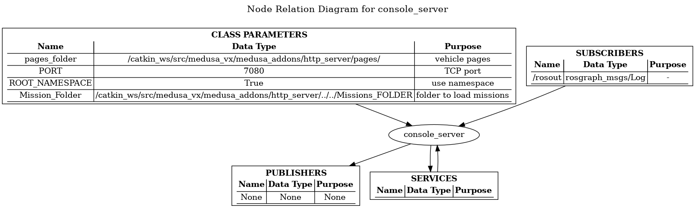

# http_server package

http_server is a ROS package written in Python responsible for exchaning information between a web console (Yebisu) and a vehicle.

## Rationale

A vehicle runs an http server and is responsible to send and read http requests. It also creates a simple html web page displaying relevant vehicle information.

**NOTE:** More details later, maybe the stack will move to rosbridge.

## Package Content

## Code documentation

[source](http://lungfish.isr.tecnico.ulisboa.pt/medusa_vx_doxy/medusa_addons/http_server/html/index.html)

## Using http_server

[Examples](./pages.html)

## Requirements

* http server
* web console (Yebisu)