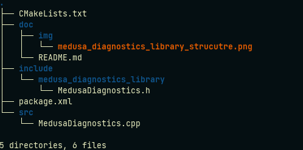

# Medusa Gimmicks Library

## Description

Collection of methods to ease the use of ROS diagnostics package.

---

## Important Sources

The library was built following the steps in this [link](https://roboticsbackend.com/ros-include-cpp-header-from-another-package/)
Also an important note about implementing template methods [here](https://stackoverflow.com/questions/1353973/c-template-linking-error). Basically this avoids linking errors with the library.

---

## How to use the library in a new node

#### CmakeLists.txt
Add library to find package 
```
find_package(catkin REQUIRED COMPONENTS
  roscpp
  medusa_diagnostics_lirabry
)
```

#### package.xml
Add the following
```
<depend>medusa_diagnostics_lirabry</depend>
```

#### Include the library in your new node

```
#include <medusa_diagnostics_library/MedusaDiagnostics.h>
```

#### Use in your code

```
MedusaDiagnostics::method_to_use(...)
```
---

## Package Content



## Code documentation

[source](http://lungfish.isr.tecnico.ulisboa.pt/medusa_vx_doxy/medusa_addons/medusa_diagnostics_library/html/index.html)
