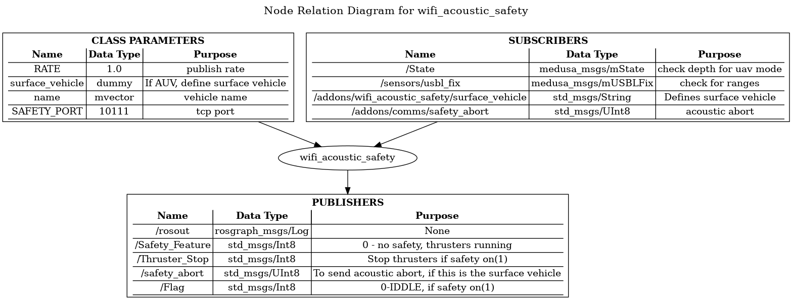
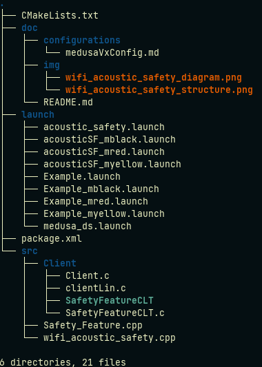

# safety_feature package

safety_feature is a ROS package written in C++ that works as an communication watchdog. 

## Rationale

The package checks if the vehicle has some kind of communication channel, wifi or acoustic. In the absence of any communication link the thrusters are stopped.
In more detail, we always check for wifi communication in surface vehicles. In the case of AUV, we need to have at least one surface vehicle that communicates via acoustic with the ones underwater. In the situation we lost wifi connection with the surface, this one is responsible to send an acoustic abort to the the underwater vehicles. 

**NOTE:** This package will need a major review later. The amount of if's else's is beyond normal. 

## Package Content

## Code documentation

[source](http://lungfish.isr.tecnico.ulisboa.pt/medusa_vx_doxy/medusa_addons/safety_feature/html/index.html)

## Using safety_feature

[Examples](./pages.html)

## Requirements

