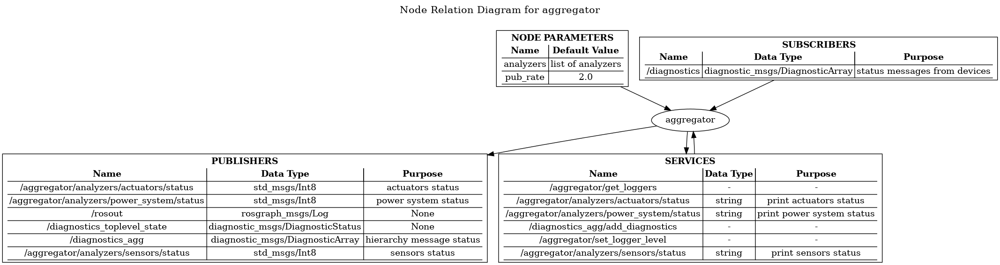
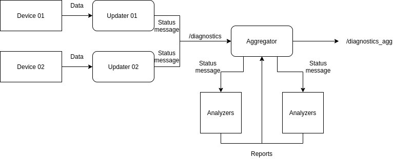
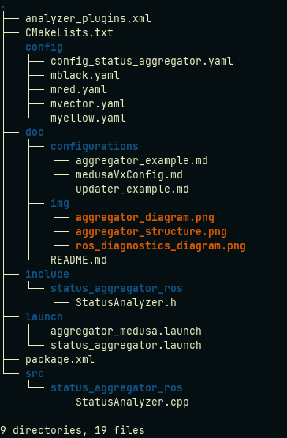

# status_aggregator package

status_aggregator is a ROS package responsible for aggregating diagnostic status messages of the system and publish them on the **/diagnostics_agg** topic. 

## Important Sources

By far the best explanation about ROS diagnostics, kudos to Nick Lamprianidis. 
[source 01](https://nlamprian.me/blog/software/ros/2018/03/21/ros-diagnostics/)
[source 02](https://nlamprian.me/blog/software/ros/2018/03/25/ros-diagnostics-continued/)

## Rationale

[ROS diagnostics](http://wiki.ros.org/diagnostics) is a tool to monitor your system. In a nutshell, status messages of the system are published on the */diagnostics* topic and are then categorized and published for easy monitoring on the */diagnostics_agg* topic. 

As you can guess, two separate components are needed for the final result: **updater** and **aggregator**. The former publishes diagnostic status messages on the */diagnostics* topic, using **tasks**. While the latter subscribes the */diagnostics* topic, aggregates and categorize the diagnostic status messages and publishes the results on the */diagnostics_agg* topic, using **analyzers**.

### Updater and task

A robot system pocesses multiple **updaters**, which are generally associated to some device (computer, motors, sensors, batteries). Each **updater** gets the relevant status information of a device through **tasks**, that function as an interface between an updater and a device. The sequence of operations is as follows:
* Device send data into a task;
* Updater forwards a status message to the task;
* Task populates status message;

When the update receives all the status messages from all the tasks it manages, it publishes them to the /diagnostics topic. The information by now has no hierarchy, difficulting the monotorization of the data.

**NOTE:** In our stack we discarded the use of the tasks, and directly populate the statuses messages in the devices.

Here is where **Aggregator** plays an important role. 

[Example updater](./configurations/updater_example.md)

### Aggregator and analyzer

**Aggregator** comes to fathom out the messy output of the **updaters**. Basically it collects, categorizes, and groups the status messages from all the **updaters** of the system. It does so by using **analyzers**. Each status message received by the **aggregator** is forward to all of the analyzers it manages. The status messages are only analyzed if its name matches some criteria of one of the **analyzers**. The **aggregator** is then responsible to request a report from each **analyzer** and publish it on the */diagnostics_add* topic. The report is just a list of status messages, one for each status item that the analyzer is responsible for, and one for the parent level that summarizes the state of its children statuses.

[Exmple aggregator](./configurations/aggregator_example.md)

## Package Content

## Code documentation

[source](http://lungfish.isr.tecnico.ulisboa.pt/medusa_vx_doxy/medusa_addons/status_aggregator/html/index.html)

## Using status_aggregator

[Examples](./pages.html)

## Requirements

* ROS diagnostics
* Information on /diagnostics topic