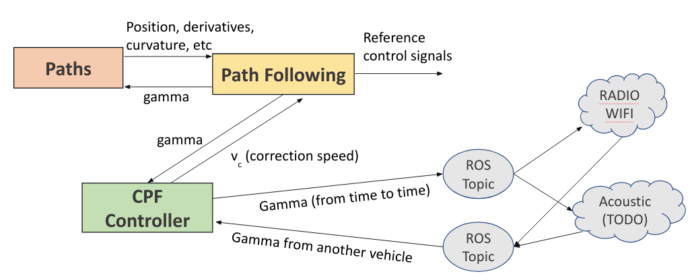
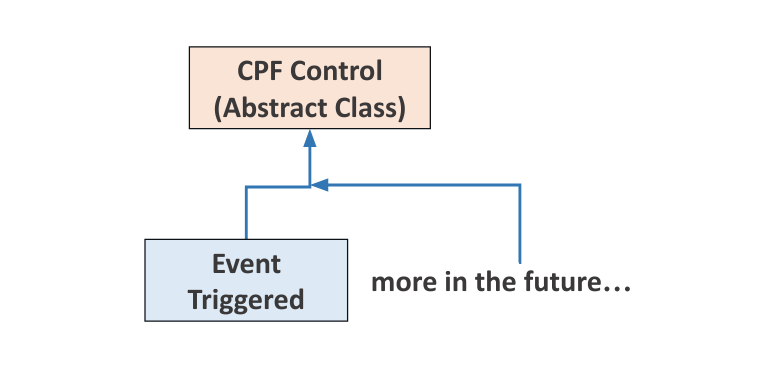
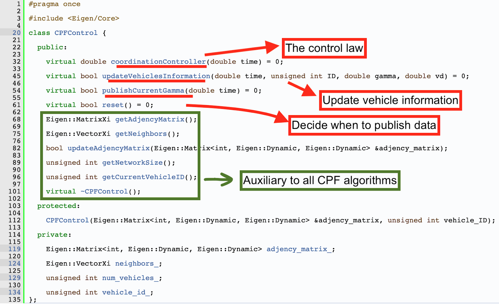
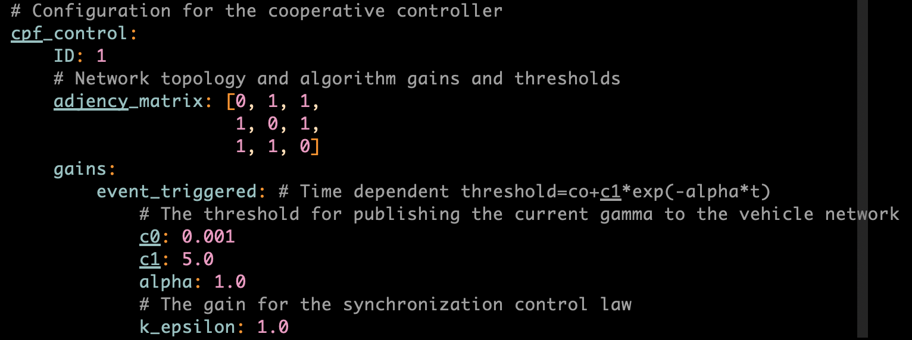

# Cooperative Path Following Documentation
A package that implements the controller responsible for synchronizing the path following controllers between multiple vehicles in a network.

**Authors:**
- Marcelo Jacinto
- João Quintas
- João Cruz
- Hung Tuan

**Maintainer:** Marcelo Jacinto

**Email:** marcelo.jacinto@tecnico.ulisboa.pt

**Creation Date:** April/2021

**Version:** 1.0.0

**Last Update:** April/2021

## Cooperative Path Following (CPF)
This controllers are only responsible for computing the correction speed for the path following virtual target and when to send information to other vehicles.

The general idea is shown in the image bellow.

In order to provide a structured way to provide several different implementations of the Cooperative Controller, the following class structured was adopted:
- **CPFControl** - Abstract class every CPF controller should inherit from
- **EventTriggered** - A class that implement CPF with event triggered communications

In the image bellow we see the idea in a more graphical way.

The cooperative abstract class (**CPFControl**) requris every class that inherits it to provide an implementation for the methods:
- **coordinationController** - the cooperative control law
- **updateVehicleInformation** - method to receive relevant data from the vehicles and store it a way relevant for the type of CPF in use
- **publishCurrentGamma** - method that should return true if we should publish the current vehicle's gamma (virtual target) value to the network.

All the other methos are auxiliar and already implemented. See picture bellow for a more in-depth overview.

Since that for now we only have one algorithm implement, there is still no service provided to switch between algorithms. Maybe in the future it will make sense and we follow an approach similar to the one used in the path following package. For now we provide the services:
- **Start**
- **Stop**
- **ChangeTopology** - to change the adjency matrix of the network, in order to simulated vehicles losing connection to each other

The default configurations for this node can be found in the next figure.
