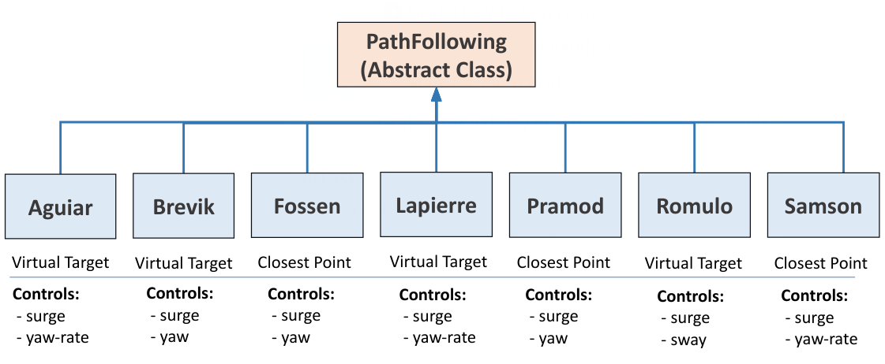
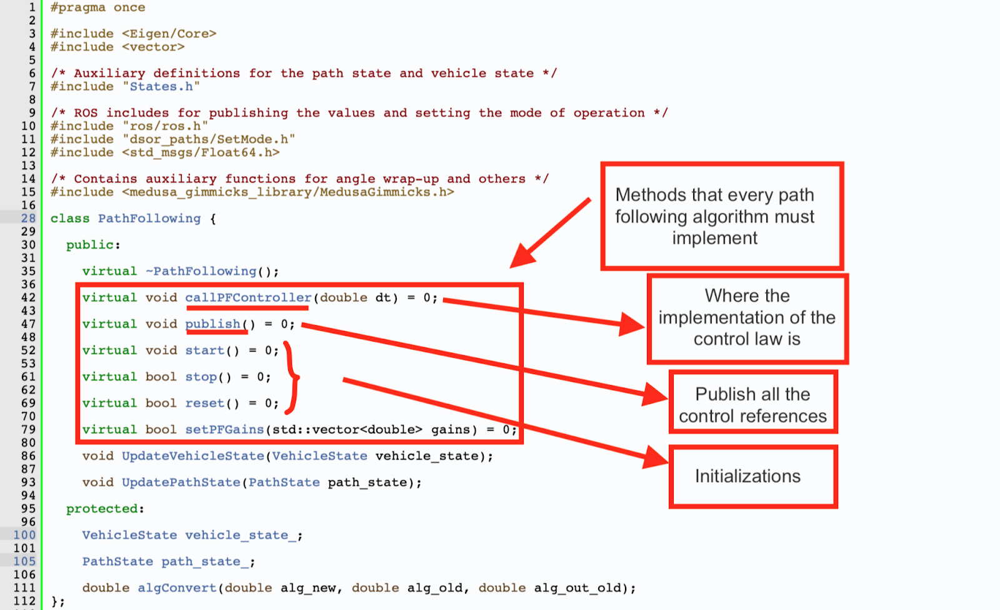
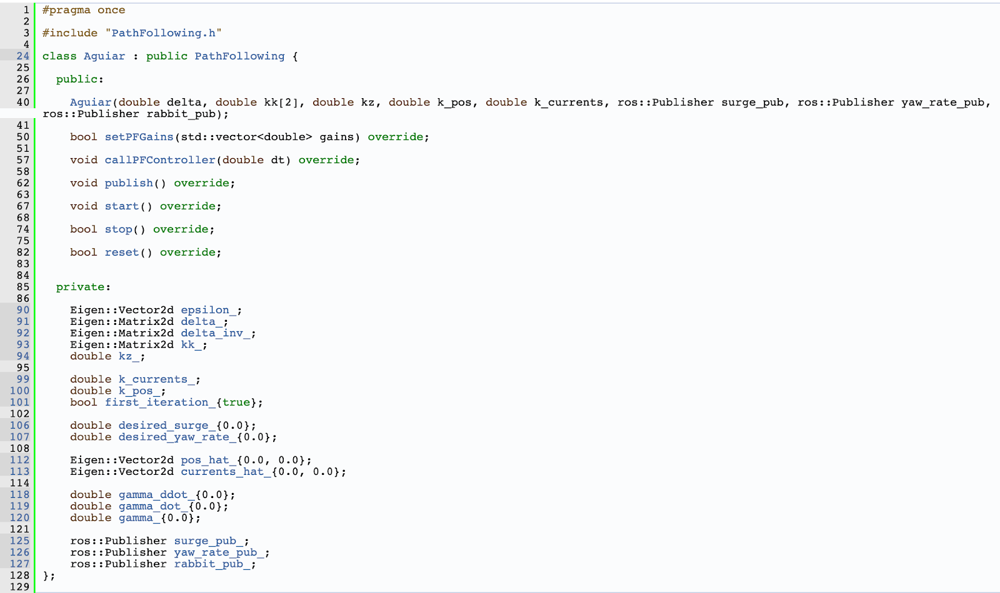
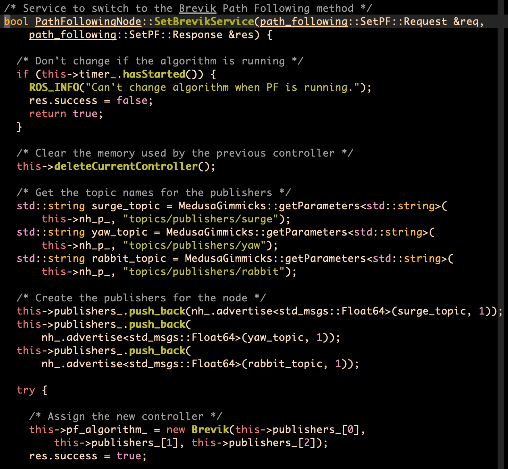

# Path Following Documentation
A package that implements the differente path following algorithm described in the literature.

By default we provide several algorithms, from Line of Sight (LOS-Fossen) to more sophisticated ones such as Lapierre.

**Authors:**
- Marcelo Jacinto
- João Quintas
- João Cruz
- Hung Tuan

**Maintainer:** Marcelo Jacinto

**Email:** marcelo.jacinto@tecnico.ulisboa.pt

**Creation Date:** April/2021

**Version:** 1.0.0

**Last Update:** April/2021

## Path Following
We start by providing a set of path following algorithms. Each algorithm inherits the class **PathFollowing**. As we see, every algorithm, even though different is implemented in the same structured manner. Some control *surge* and *yaw*. Others control *yaw rate* and other control *sway*. Some use the *closest point to the path* in the computations, and some use an *adptive virtual target*.

The number of algorithms implemented is expected to grow with time. To see all the current path following algorithms implemented check the provided classes API. Here is an example of some of them provided (see image bellow).

In order to implement a path following algorithm must implement the method *callPFController* where the actual control law implementation is done.

The *publish* method serves the purpose of publishing the relevant control signals to the relevant topics (received in the constructor of the concrete path following we are implementing - more on that later).

The *start*, *stop* and *reset* methods are auxiliar and their names I believe are self explanatory.

The *setPFgains* is used to receive a vector of gains and map to controller gains (which might be different for each controller).

Bellow we show a particular example applied to the **Aguiar** controller. The constructor of this clas receives the controller gains and the 3 publishers:
- A surge publisher
- A yaw rate publisher
- A rabbit publisher (virtual target)

The reason we pass ROS publishers or services as arguments (and we are not able to provide the same level of abstraction as in paths) is that every controller migh publish different kinds of references signals. On the paths class the published data is all the same. 

In Aguiar's case, since the mode of operation required for the path is the default (given a gamma, publish path data), we only need to publish at start (in start method) the initial gamma (in order to initiate the loop in which the path sends us data back).

For example, in Fossen's case, since the mode of operation is closest point, we need to receive in the constructor the service used to change the mode of operatin of the path (and call it in the start method).

I invite you to checkout the *start* method in these 2 implementations to understand the conceptual differences.

## How to interface with ROS
We have already got a glimpse on how to interface with ROS. We pass as arguments to the constructor of the class the publishers that we need.

Similar to the **paths** class, we also have services to change between controllers. One service for each controller. Furthermore we also develop one callback for each service (see image bellow).

In order to implement a service we can use the picture bellow as a blueprint. It is almost always the same. We only need to:

- clear the previous control 
- define a set of publishers
- save the publisher into the publisher vector (this step is import as this vector is cleared every time we change between controllers). The old publishers are de-registered
- we read the controller gains from the parameter server
- instantiate the controller node we desired
- return success!

Bellow we provide a sample implementation applied to the case of Brevik algorithm.

