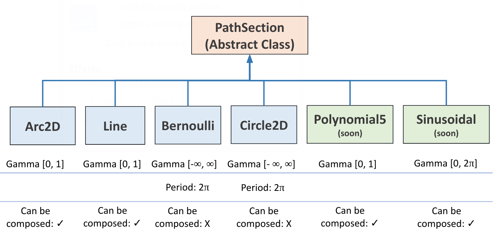
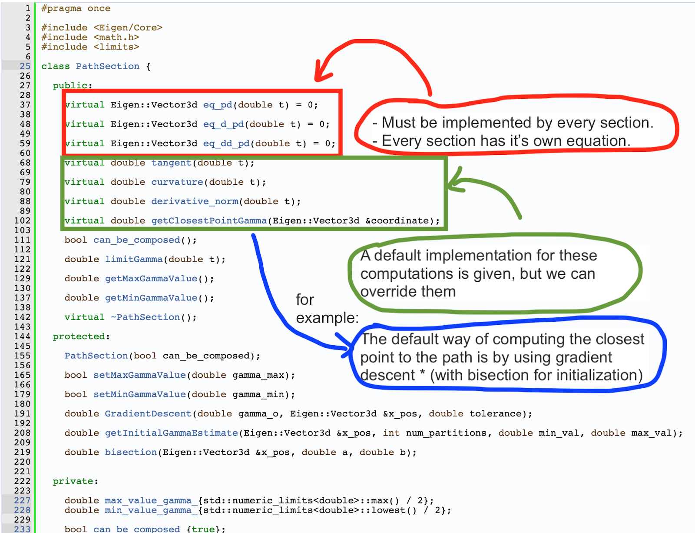
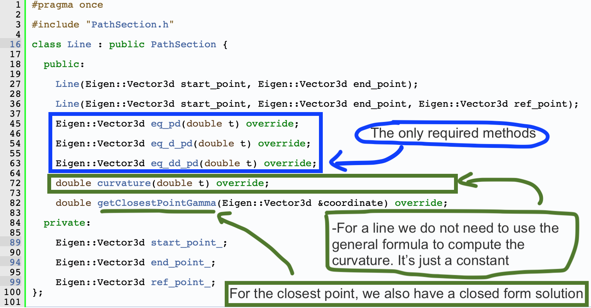
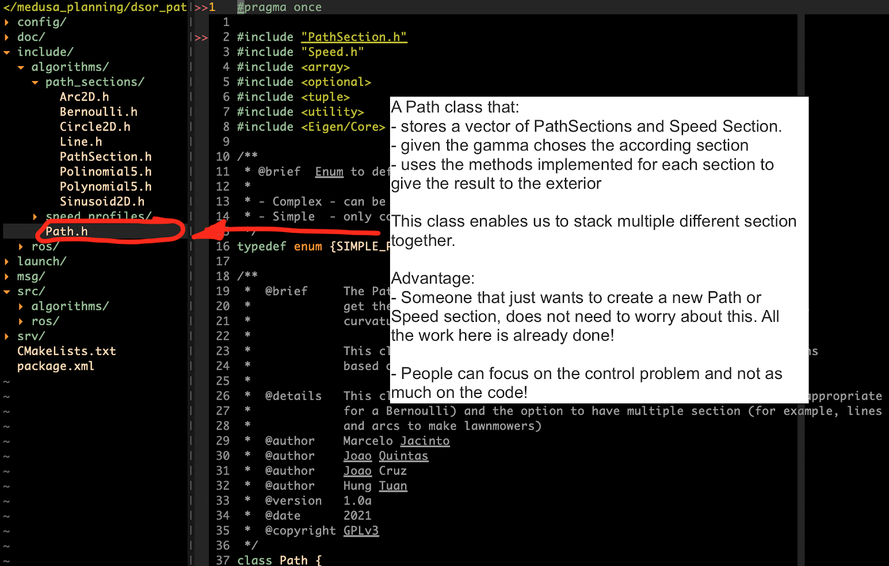
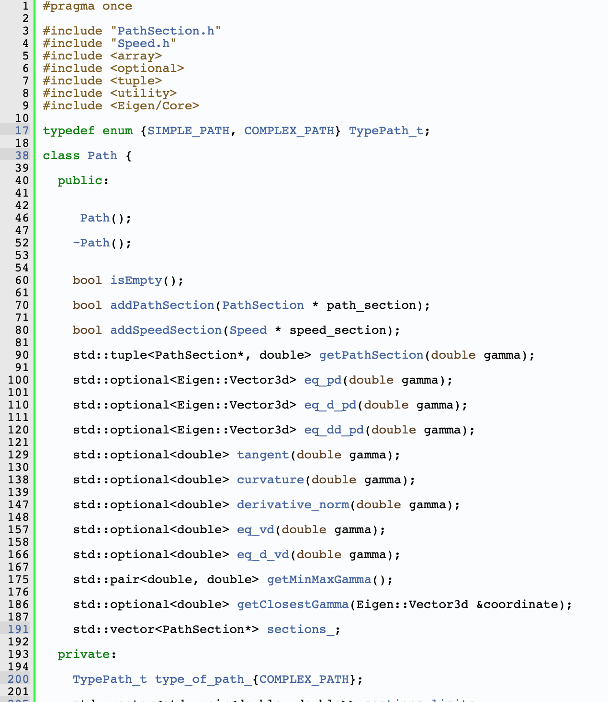
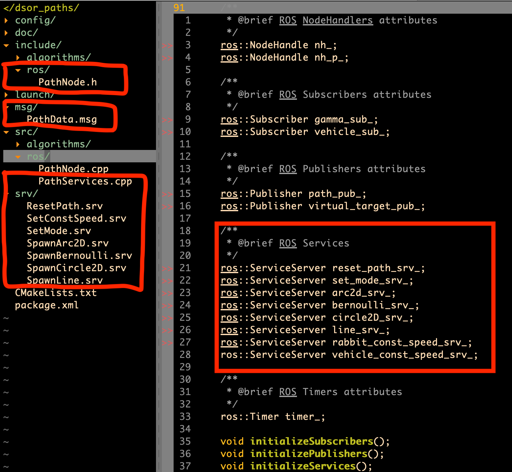
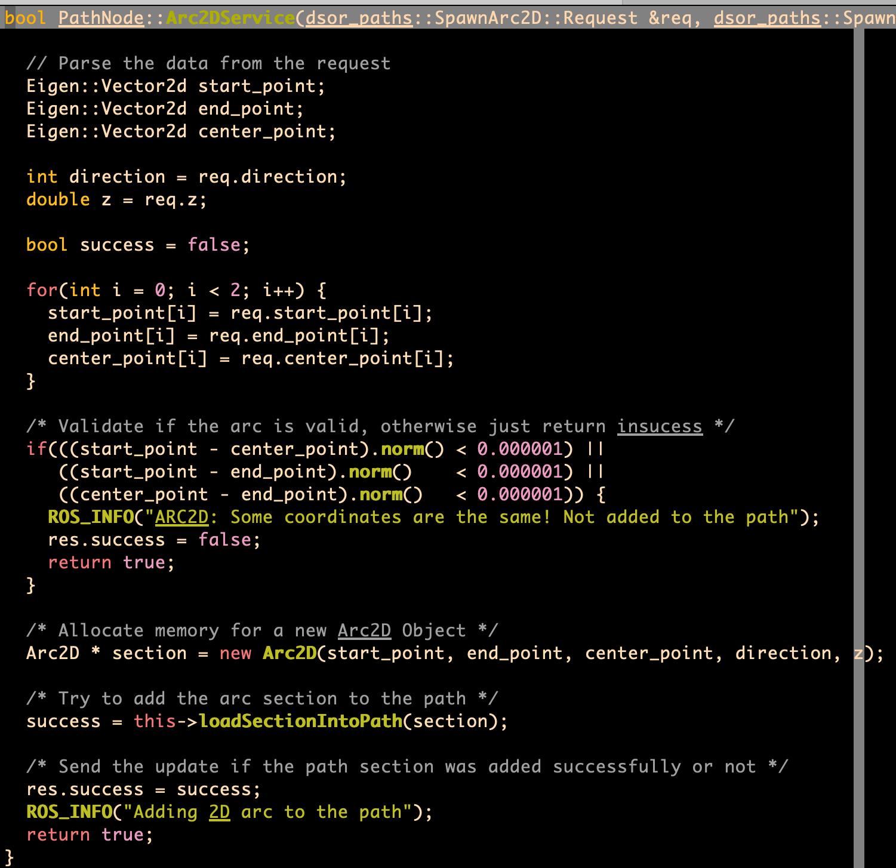

# Dsor Paths Documentation
A package that implements the equations of paths parameterized by a path parameter (gamma).

By default we provide several path sections, from arcs to bernoulli lemnicaste.

**Authors:**
- Marcelo Jacinto
- João Quintas
- João Cruz
- Hung Tuan

**Maintainer:** Marcelo Jacinto

**Email:** marcelo.jacinto@tecnico.ulisboa.pt

**Creation Date:** April/2021

**Version:** 1.0.0

**Last Update:** April/2021

## Path Sections

We start by providing a set of sections. Each section inherits the class **PathSection**. As we see, every section, even though different is implemented in the same structured manner. The number of sections implemented will grow with time. To see all path available check the provided classes API. Here is an example of some of them provided (see image bellow).



The goal is for you to keep building on top of this library and add your own costume sections.

But how is a path section made? Well you are only required to be able to implement the path position, it's derivative and second derivative given the path parameter (gamma). The rest is done for you (but of course you can always override default implementations). In the image bellow we can check an example of this.



For example, in the Line implementation we are only required to implement the functions:
- eq_pd(gamma) - path equation (evaluated at gamma)
- eq_d_pd(gamma) - derivative of the path equation (evaluated at gamma)
- eq_dd_pd(gamma) - second derivative of the path equation (evaluated at gamma)

But since the curvature is constant for a line, there is no need to compute it using the standard way for a line. We can just override the standard implementation and just return 0.

The same applies to the getClosestPointGamma method. The default implementation uses an iterative method to compute this point in the path (gradient descent). But, for a line we have a closed form solution. This is why we override the function and implement a better solution that exists for this kind of section (see image bellow).


In addition you must specify what are the bounds of your section. By default it is [-infinity, +infinity] but that might not make sense for your section. Furthermore, you must also define if you section can be composed or not. These parameters should be setup in the constructor of your path section. *See Arc2D section for a detailed example*.

But, once again, what does this it mean for a section to be able to be composed? Well when you define a section you must also pass to the constructor of **PathSection** whether you allow this section to be used with more sections or not. For example, for a **Line** and an **Arc** it makes sense for them to be composed (in order to generate paths like lawnmowers). On the other hand it makes no sense for a **Bernoulli** to be composed with other sections, as it is a closed shape in which bounds vary from [-inf, inf].

## Speed Sections
Similar to the path sections we also implement speed sections. By default the speed sections are even simpler to implement (but we only provide constant speeds). Feel free to add more types of speed profiles! For an example on how to implement one, check the class API.

## Putting sections together
In order to glue the sections together we provide the class **Path**. This class basically stores a vector of sections (if the first section added *can be composed*). This class also stores a vector of speed sections. The number of speeds asked to the path must be the same or lower than the number of path sections. What does this mean in practise? Well, if you add a line section, only then you can add a speed section (or not - speed sections are optional). Let's imagine we add a line and an arc. We can then add a 2 speed sections or 1. By default, if you only add one, the speed that will be desired after the first section finishes is given by the default value specificied in the speed section.

The goal of this class is that all the dirty logic and abstraction is already provided to the developer. Therefore, people only have to focus on implementing costume sections for their algorithms to follow.


In the image bellow, we can see all the API provided by the **Path** class. In practise, users do not need to worry about this path. As long as new sections inherit **SpeedSection** or **PathSection** they will work with the path class.



## How to interface this library with ROS

The introduced library is completely independent from ROS. Therefore, in order to interface the library with ROS we use **services**. For every path section and speed section we create a **ROS Service**. For example, for a **Bernouli** we provide a service of the type */SpawnBernoulli*. The same applies for lines, arcs,... (see image bellow)



To create a service is almost the same as creating a message in ROS. Here is an example for a *SpawnBernoulli.srv*:
```
float64 radius
float64 center_x
float64 center_y
float64 z
---
bool success
```

In the service callback implementation we just receive the data necessary to initialize the section and create a new object of that section. Afterward we just need to call the method to add that section to the path and voila! It's done! By the way, all of this is done in the *PathServices.cpp* and *PathNode.h*.

See the image bellow for a concrete example.



## Modes of operation
Since some path following algorithms require us to use the cloest point of the vehicle in the path, we need to be able to compute this. Therefore we implement the *getClosestPointGamma(coordinate)* method. This method is supposed to receive the coordinates of the vehicle and give the gamma of the path that encodes the closest point. With that gamma value we can compute anything.

Modes of operation:
- Listen to a gamma (default)
- Closest Point

To change between modes we provide a service */SetMode*. To reset the path we also provide the service */ResetPath*. When we reset the path all the section that are inside are clean (both speed and path sections). In addition the mode of operation is also reset to its default value (listen to gamma) and publish the data.

## Data published by the ROS node

In order to publish all the relevant data from a path evaluated at a specific value of gamma we provide a new ROS message - *PathData.msg*:
```
Header header
float64[3] pd            # Path position
float64[3] d_pd          # First derivative
float64[3] dd_pd         # Second derivative
float64 curvature
float64 tangent
float64 derivative_norm
float64 vd               # Desired speed for gamma
float64 d_vd             # Desired accel. for gamma
float64 vehicle_speed    # Desired vehicle speed
float64 gamma_min        # Min gamma of the path
float64 gamma_max        # Max gamma of the path
```